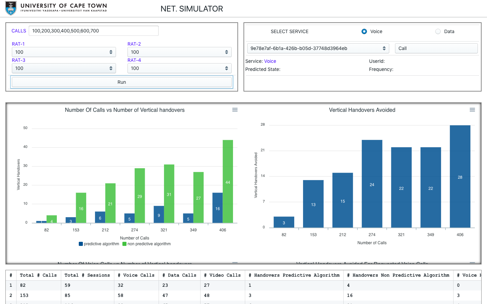

# Call-Handover-Prediction-Using-Caller-History
Predictive algorithm to perform Vertical Call Handover decisions in a 5g network using mobile user caller history logs




To run application in developer mode run the following commands

1. Install Latest version of Node.JS [https://nodejs.org/en/download/]
2. Install DotnetCore 3.0 SDK [https://dotnet.microsoft.com/download]

```
$ git clone https://github.com/Chitova263/Call-Handover-Prediction-Using-Caller-History.git
$ cd src
$ yarn install
$ dotnet restore ./Core
$ yarn electron-dev
```
 To build standalone desktop
 
 ```
 $ git clone https://github.com/Chitova263/Call-Handover-Prediction-Using-Caller-History.git
 $ cd src
 $ yarn electron-pack
 ```
 
 Copy the src/Core folder and calllogs.csv file into 
 ```
 src/dist/win-unpacked
 ```
 
 run MyApp.exe
